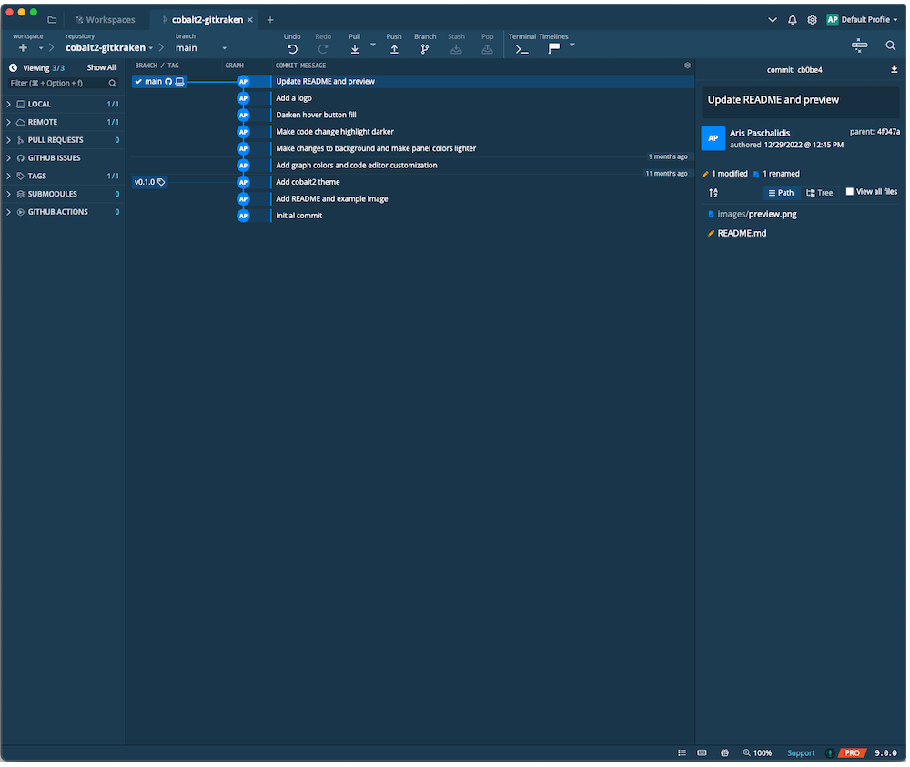

#  
# Cobalt2 Theme for Gitkraken

GitKraken now supports custom user-defined themes. This repository contains the Cobalt2 theme, based on the [Cobalt2 theme for vscode](https://github.com/wesbos/cobalt2-vscode).

## Preview

## Installation

Copy the `cobalt2.jsonc` file to `~/.gitkraken/themes`.

Preferences: 
1. Navigate to `Preferences > UI Customization > Theme`
1. Select `Cobalt2`

Command Pallete:
1. Use the keyboard shortcut <kbd>Cmd</kbd> <kbd>P</kbd> or <kbd>Ctrl</kbd>
   <kbd>P</kbd>
1. Type `Switch Theme`
1. Enter `Cobalt2`
